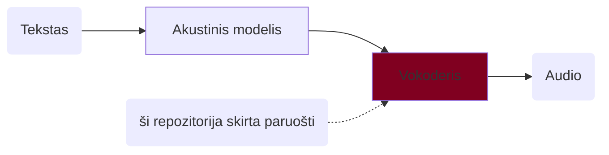

## Sintezės emocinis garsynas

Nuoroda į garsyną: *TBD (bus papildyta vėliau)*

### Turinys
- [Sintezės emocinis garsynas](#sintezės-emocinis-garsynas)
  - [Turinys](#turinys)
  - [Apie](#apie)
  - [Reikalavimai](#reikalavimai)
  - [Diegimas](#diegimas)
  - [Mokymas](#mokymas)
    - [SE garsynas](#se-garsynas)
    - [Mokymas su kitu garsynu](#mokymas-su-kitu-garsynu)

### Apie

Ši repozitorija yra kopija (*fork*) iš https://github.com/kan-bayashi/ParallelWaveGAN. Ji skirta sintezės vokoderiams mokyti ir paruošti. Vokoderis generuoja garso signalą iš mel spektrogramos. Žemiau pateikta šnekos sintezės schema ir šios repozitorijos paskirtis joje:



Naudodami šios repozitorijos skriptus galime apmokyti įvairių tipų vokoderius. Žr. [pagrindinę repozitoriją](https://github.com/kan-bayashi/ParallelWaveGAN).

Šioje direktorijoje skriptai pritaikyti specialiai SE garsynui, tačiau juos galima naudoti ir vokoderiui mokyti su kitais garso failais. Čia skriptai sukonfigūruoti `StyleMelGAN` tipo vokoderiui ruošti. Informacija apie vokoderio panaudojimą pateikta [ESPNet repozitorijoje](https://github.com/airenas/espnet/blob/master/egs2/seg/tts1/README.lt.md).

### Reikalavimai

| | | |
|-|-|-|
| OS | Linux (Debian, Ubuntu) | Scenarijai veikia Linux aplinkoje (išbandyta su Ubuntu ir Debian, tačiau turėtų veikti ir kitose distribucijose). Windows kompiuteryje galima mokyti naudojant WSL. |
| RAM | >32 GB | |
| HDD | >70 GB | |
| GPU | >=10 GB | |
| CUDA | CUDA 11 arba CUDA 12 | |
| Programos, bibliotekos | git, make, conda, libsndfile | |

### Diegimas

```bash
## įdiegiame reikalingus įrankius ir bibliotekas
sudo apt install git make libsndfile-dev
### parsisiunčiame šią repozitoriją
git clone https://github.com/airenas/ParallelWaveGAN.git
cd ParallelWaveGAN
### pasiruošiame Python 3.10 aplinką
conda create -n pwgan python=3.10
conda activate pwgan
### įdiegiame paketą
pip install -e . --no-build-isolation
### pataisome kai kurių bibliotekų versijas
pip install scipy==1.10.1

### jei sistemoje yra CUDA 11 tvarkyklės,
### įdiegiame senesnę torch versiją
# pip install torch==1.13.1 torchvision==0.14.1 torchaudio==0.13.1
```

Patikriname, ar GPU aptinkamas sukurtoje Python aplinkoje ir ar tvarkyklė sėkmingai užkraunama:

```bash
### patikriname
cd egs/seg/voc1
make info
```

Jei viskas gerai, turėtume matyti:

```txt
....
cuda in python: 	12.x (arba 11.x)
```

### Mokymas

#### SE garsynas

1. Parsisiunčiame garsyną ZIP formatu: *TBD*.
2. Šioje direktorijoje paruošiame `make` konfigūracijos failą `Makefile.options`.

   Nurodome:
   1. kelią iki garsyno ZIP failo;
   2. kalbėtoją, pvz., kalbėtojo vardą arba sutrumpinimą;
   3. eksperimentų direktoriją (`work_dir`), kurioje bus saugomi tarpiniai duomenys ir galutinis modelis;
   4. versiją (nebūtina), skirtą galutiniam modelio failui pažymėti.

   `Makefile.options` pavyzdys:
   ```make
   corpus_file?=/home/user/dwn/corpus/AGN-1.0.zip
   speaker?=agn
   work_dir?=agn-01
   version?=v01
   ```
3. Patikriname konfigūraciją.

   Vykdome komandą `make info`. Rezultato pavyzdys:
   ```txt
   corpus_file: 	/mnt/corpus/AGN-1.0.zip
   work_dir: 		agn-01
   train_config: 	conf/style_melgan.v1.yaml
   speaker: 		agn
   dev_count: 		250
   exp_dir: 		agn-01/exp/train_nodev_agn_style_melgan.v1
   final_model: 	agn-01/agn.style.v01-1000000.tar.gz
   nvidia-smi: 		NVIDIA RTX 4000 Ada Generation, 20475 MiB, 580.126.09
   cuda visible dev: 	
   python: 			Python 3.10.20
   torch: 			2.10.0+cu128
   cuda in python: 	12.8
   ```

   Patikriname, ar garsyno failas ir eksperimentų direktorija nurodyti teisingai.
   Taip pat patikriname, ar GPU teisingai inicializuojamas Python aplinkoje. Lauke `cuda in python:` turi būti rodoma versija.
4. Paleidžiame mokymą.

   ```bash
   make build
   ## arba, kad mokymas nenutrūktų uždarius terminalo langą
   nohup make build &
   ```

   Modelis bus apmokytas, išsaugotas ir paruoštas faile `${work_dir}/${speaker}.style.${version}-1000000.tar.gz`.
   Mokymo eiga matoma terminalo lange. Jei paleidžiama su `nohup`, ji bus įrašoma į `nohup.out` failą. Pvz.: `tail -f nohup.out`.

Preliminari mokymo trukmė su vienu SE garsyno kalbėtoju (18 h garsyno):

| GPU | Laikas |
| -- | --- |
| GeForce GTX 1080 Ti, 11178 MiB | apie 14 dienų |
| NVIDIA RTX 4000 Ada Generation, 20475 MiB | apie 8 dienas |

#### Mokymas su kitu garsynu

1. Įdėkite garso failus į `downloads/corpus/wavs`. Failų formatas turi būti mono, 16 bitų PCM WAV, 22050 Hz. (Pvz., galite konvertuoti garso failus komanda `ffmpeg -i {input} -ar 22050 -ac 1 -sample_fmt s16 {output}.wav`.)
2. Pažymėkite, kad garsynas paruoštas: `touch downloads/corpus/.done`. Garsyno katalogo struktūros pavyzdys:

```tree
downloads
└── corpus
    ├── .done
    └── wavs
        ├── 00007600-d7ba-41a5-bf11-6369fe31bbbe.wav
        ├── 0000b912-b69e-4919-b581-e047aa60dd82.wav
        ├── 00018c30-6e45-4039-b5d6-ab1de5ce861e.wav
        ├──             ...
```

3. Tęskite mokymą kaip [SE Garsynas](#se-garsynas) punkte. Konfigūracijoje nurodytas kelias iki garsyno (`corpus_file`) nebus naudojamas.
