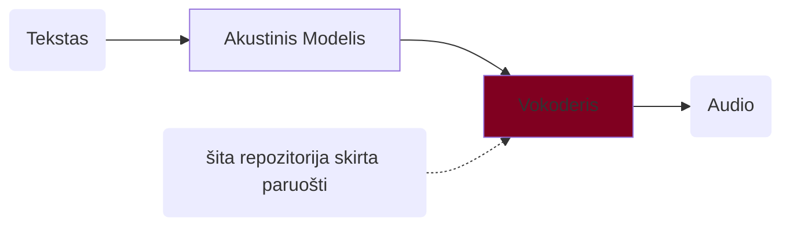

## Sintezės emocinis garsynas

### Turinys
- [Sintezės emocinis garsynas](#sintezės-emocinis-garsynas)
  - [Turinys](#turinys)
  - [Apie](#apie)
  - [Reikalavimai](#reikalavimai)
  - [Instaliavimas](#instaliavimas)
  - [Mokinimas SEG](#mokinimas-seg)
  - [Mokinimas su kitu garsynu](#mokinimas-su-kitu-garsynu)

### Apie

Ši repositorija yra kopija iš: https://github.com/kan-bayashi/ParallelWaveGAN. Repozitorija skirta mokinti ir paruošti sintezės vokoderius. Vokoderis generuoja audio signalą iš mel-spektogramos. Žemiau pateikta šnekos sintezės schema ir šios repozitorijos paskirtis joje:



Su šios repozitorijos skriptais galime apmokinti įvairių tipų vokoderius. Žr.: [pagr. repozitorija](https://github.com/kan-bayashi/ParallelWaveGAN). 

Šioje direktorijoje skriptai pritaikyti specialiai SE Garsynui. Bet gali būti naudojami mokinti vokoderį turint ir kitus audio failus. Čia skriptai sukonfigūruoti ruošti StylMelGAN tipo vokoderį. Vokoderio panaudojimo informacija pateikta kitoje: [ESPNet repozitorijoje](https://github.com/airenas/espnet)

### Reikalavimai

| | | |
|-|-|-|
| OS | Linux (Debian, Ubuntu) | Skriptai veikia Linux OS (išbandyta Ubuntu, Debian, bet turėtų veikti ir kitose distribucijose). Windows mašinoje galima mokinti naudojant WSL. |
| RAM | >32Gb | |
| HDD | >70Gb | |
| GPU | >=10Gb | |
| CUDA | CUDA11, CUDA12 | |
| Programos, bibliotekos | git, make, conda, libsndfile | |


### Instaliavimas

```bash
### parsisiunčiame šią repozitoriją
git clone https://github.com/airenas/ParallelWaveGAN.git
cd ParallelWaveGAN
### pasiruošiame python 3.10 aplinką
conda create -n pwgan python=3.10
conda activate pwgan
### instaliuojame
pip install -e . --no-build-isolation
### kai kurios bibliotekos suinstaliuojamos per naujos
pip install scipy==1.10.1

### Jei sistemoje yra CUDA11 driveriai
### suinstaliuojame senesnį pytorch
# pip install torch==1.13.1 torchvision==0.14.1 torchaudio==0.13.1
```

Patikriname ar GPU randamas sukurtoje python aplinkoje, ar driveris užkraunamas:
```bash
### patikriname 
cd egs/seg/voc1
make info
```
Jei viskas gerai, turėtume matyti:
```txt
....
cuda in python: 	12.x (arba 11.x)
```

### Mokinimas SEG

1. Parsisiunčiame garsyną zip formatu: <pending>.
2. Pasiruošiame `make` konfigūracinį failą : `Makefile.options` šioje direktorijoje:
   Nurodome:
   1. kelią iki garsyno zip failo
   2. kalbėtoją
   3. eksprerimentų direktoriją (work_dir)
   4. varsiją (neprivaloma) - bus pažymėtas galutinis modelio failas

   Pvz:
   ```make
   corpus_file?=/home/user/dwn/corpus/AGN-1.0.zip
   speaker?=agn
   work_dir?=agn-01
   version?=v01
   ```
3. Patikriname konfigūraciją
   Run `make info`

   ```txt
   corpus_file: 	/mnt/corpus/AGN-1.0.zip
   work_dir: 		agn-01
   train_config: 	conf/style_melgan.v1.yaml
   speaker: 		agn
   dev_count: 		250
   exp_dir: 		agn-01/exp/train_nodev_agn_style_melgan.v1
   final_model: 	agn-01/agn.style.v01-1000000.tar.gz
   nvidia-smi: 		NVIDIA RTX 4000 Ada Generation, 20475 MiB, 580.126.09
   cuda visible dev: 	
   python: 			Python 3.10.20
   torch: 			2.10.0+cu128
   cuda in python: 	12.8

   ```
   Patikriname ar garsyno failas ir eksperimentų direktorija teisinga.
   Patikriname GPU inicializuojamas teisingai python aplinkoje (`cuda in python: ` rodo versiją).
4. Mokiname
   ```bash
   make build
   ## or in background
   nohup make build &
   ```
   Modelis bus apmokintas, išsaugotas ir paruoštas `${work_dir}/${speaker}.style.${version}-1000000.tar.gz` faile.

Preliminarūs mokinimo laikai su SE garsyno vienu kalbėtoju (18h)
| GPU | Laikas |
| -- | --- |
| GeForce GTX 1080 Ti, 11178 MiB | apie 14 dienų |
| NVIDIA RTX 4000 Ada Generation, 20475 MiB | apie 6 dienas  |

### Mokinimas su kitu garsynu

1. Padėkite audio failus `downloads/corpus/wavs`. Failų formatas turi būti mono 16-bit PCM WAV 22,050 kHz dažniu. (Pvz.: galite konvertuoti audio failus su komanda `ffmpeg -i {input} -ar 22050 -ac 1 -sample_fmt s16 {output}.wav`)
2. Pažymėkite, kad garsynas paruoštas: `touch downloads/corpus/.done`
3. Tęskite mokinimą kaip [Mokinimas SEG](#mokinimas-seg). Konfigūracijoje `kelias iki garsyno` (`corpus_file`) bus nenaudojamas.
